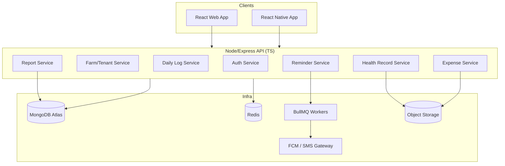
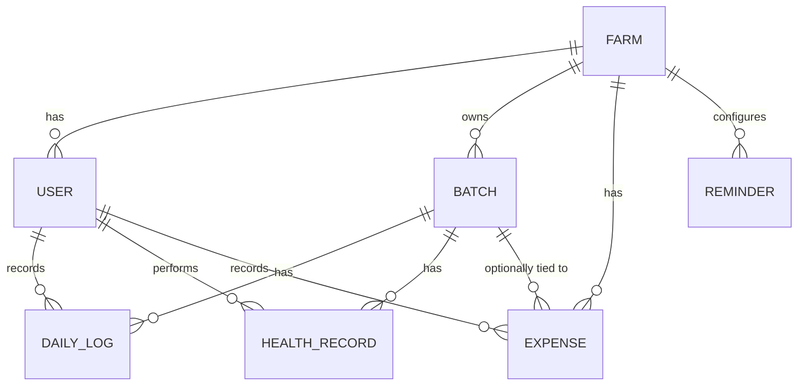

# PoultryOps — Implementation Plan
### Multi-tenant Poultry Farm Management SaaS (Web + Mobile)

This plan is written to be handed directly to **Google Antigravity** as a project spec — it's broken into phases small enough to become individual Antigravity **Plan Artifacts**, with acceptance criteria an agent (or you, reviewing) can check off.

---

## 1. Product Summary

| | |
|---|---|
| **Type** | Multi-tenant SaaS |
| **Platforms** | Web (React) + Mobile (React Native) |
| **Primary users** | Farm Owners, Managers, Workers |
| **Core loop** | Worker logs daily data → Owner tracks cost/health/production → System reminds & reports |

---

## 2. Tech Stack

| Layer | Choice | Why |
|---|---|---|
| API | Node.js + Express + TypeScript | Matches your existing stack |
| Web | React + TypeScript + Vite + TanStack Query + Tailwind | Fast, shared types with API |
| Mobile | React Native (Expo) + TypeScript | Code-share with web via shared `packages/types` |
| DB | MongoDB (Atlas) | Flexible schema, good for multi-tenant + reporting via aggregation |
| Cache/Queue | Redis + BullMQ | Reminders, report jobs, rate limiting |
| Auth | JWT (access + refresh) | Stateless, works across web + mobile |
| File storage | S3-compatible (Cloudflare R2 or AWS S3) | Health record photos, receipts |
| Notifications | FCM (push) + Twilio/WhatsApp Business API (optional) | BD farmers may prefer SMS/WhatsApp over app push |
| Monorepo | Turborepo | Shared types/UI between web + mobile + API |
| CI/CD | GitHub Actions | Free, integrates with your GitHub |
| Hosting | API: Render/Railway/Fly.io; Web: Vercel; DB: Atlas free tier | Cheap to start, scales up |

---

## 3. Monorepo Structure

```
poultry-ops/
├── apps/
│   ├── api/                  # Express + TS backend
│   ├── web/                  # React web app
│   └── mobile/               # React Native (Expo) app
├── packages/
│   ├── types/                 # Shared TS interfaces (Farm, User, Batch, DailyLog...)
│   ├── validation/            # Shared Zod schemas (used by API + both clients)
│   ├── ui/                    # Shared design tokens / cross-platform components
│   └── config/                # Shared eslint/tsconfig
├── turbo.json
└── package.json
```

**Why this matters for Antigravity:** give the agent a `.antigravity/rules.md` (or equivalent project-context file) pointing at this structure and the shared `packages/types` — this stops each agent run from redefining the `Batch`/`DailyLog` interfaces slightly differently across api/web/mobile, which is the most common thing that goes wrong when an agent works across a monorepo unsupervised.

---

## 4. System Architecture



**Multi-tenancy approach:** shared database, every collection carries `farmId`. A single Express middleware (`resolveTenant`) extracts `farmId` from the JWT and injects it into a request-scoped context; a Mongoose plugin auto-applies `farmId` filters to every query so no route can accidentally leak cross-tenant data. This is the single most important guardrail in the whole system — enforce it at the data layer, not in each controller.

---

## 5. Database Design

### 5.1 Entity Relationship Diagram



### 5.2 Collections

**`farms`**
```typescript
{
  _id: ObjectId,
  name: string,
  ownerId: ObjectId,        // ref -> users
  plan: 'free' | 'pro',
  timezone: string,          // important for reminder scheduling
  createdAt: Date
}
```

**`users`**
```typescript
{
  _id: ObjectId,
  farmId: ObjectId,          // tenant key - indexed
  name: string,
  email: string,             // unique per farm, not globally
  phone?: string,
  passwordHash: string,
  role: 'owner' | 'manager' | 'worker',
  fcmTokens: string[],       // for push notifications
  isActive: boolean,
  createdAt: Date
}
// Index: { farmId: 1, email: 1 } unique
```

**`batches`**
```typescript
{
  _id: ObjectId,
  farmId: ObjectId,          // indexed
  name: string,              // "Batch 12 - Broiler"
  breed: string,
  type: 'layer' | 'broiler',
  startDate: Date,
  initialCount: number,
  currentCount: number,      // maintained via log writes
  shed?: string,             // physical location, useful once farms scale
  status: 'active' | 'closed',
  closedAt?: Date
}
// Index: { farmId: 1, status: 1 }
```

**`daily_logs`**  *(the highest-write-volume collection — this is the daily worker form)*
```typescript
{
  _id: ObjectId,
  farmId: ObjectId,
  batchId: ObjectId,
  date: Date,                // stored as date-only (midnight UTC) for easy grouping
  eggCount: number,
  brokenEggCount: number,
  deadCount: number,
  feedGivenKg: number,
  waterGivenLiters: number,
  medicineGiven?: { name: string; dose: string; unit: string }[],
  recordedBy: ObjectId,      // ref -> users
  notes?: string,
  createdAt: Date
}
// Index: { farmId: 1, batchId: 1, date: -1 } unique compound
// (prevents duplicate log entries for same batch+date)
```

**`health_records`**
```typescript
{
  _id: ObjectId,
  farmId: ObjectId,
  batchId: ObjectId,
  date: Date,
  type: 'checkup' | 'vaccination' | 'injection' | 'treatment',
  description: string,
  medicineUsed?: string,
  performedBy: string,       // vet name or staff name (free text, not always a User)
  cost?: number,
  attachmentUrls?: string[], // S3 keys for report photos
  createdBy: ObjectId,
  createdAt: Date
}
// Index: { farmId: 1, batchId: 1, date: -1 }
```

**`expenses`**
```typescript
{
  _id: ObjectId,
  farmId: ObjectId,
  batchId?: ObjectId,        // null = farm-wide cost (electricity, rent)
  category: 'feed' | 'medicine' | 'labor' | 'utility' | 'equipment' | 'other',
  amount: number,
  currency: string,          // default BDT
  date: Date,
  note?: string,
  receiptUrl?: string,
  recordedBy: ObjectId,
  createdAt: Date
}
// Index: { farmId: 1, date: -1 }, { farmId: 1, category: 1, date: -1 }
```

**`reminders`**
```typescript
{
  _id: ObjectId,
  farmId: ObjectId,
  batchId?: ObjectId,
  type: 'feed' | 'water' | 'medicine' | 'custom',
  message: string,
  cronExpression: string,    // e.g. "0 7,17 * * *"
  assignedTo: ObjectId[],    // empty = all workers on this farm
  channel: ('push' | 'sms')[],
  active: boolean,
  createdBy: ObjectId
}
```

**`report_cache`** *(optional — add only if aggregation gets slow)*
```typescript
{
  _id: ObjectId,
  farmId: ObjectId,
  batchId?: ObjectId,
  period: 'monthly' | 'yearly',
  periodKey: string,         // "2026-07" or "2026"
  metrics: {
    totalEggs: number,
    totalBrokenEggs: number,
    totalDead: number,
    mortalityRate: number,
    totalFeedKg: number,
    totalWaterLiters: number,
    totalCost: number,
    costByCategory: Record<string, number>,
    costPerEgg: number,
    costPerBird: number
  },
  generatedAt: Date
}
```

---

## 6. API Design (REST)

```
Auth
  POST   /auth/register-farm       # creates Farm + first Owner user
  POST   /auth/login
  POST   /auth/refresh
  POST   /auth/logout

Users (owner/manager only)
  POST   /users                    # invite a worker/manager
  GET    /users
  PATCH  /users/:id                # change role, deactivate

Batches
  POST   /batches
  GET    /batches?status=active
  GET    /batches/:id
  PATCH  /batches/:id
  POST   /batches/:id/close

Daily Logs
  POST   /batches/:id/logs
  GET    /batches/:id/logs?from=&to=
  PATCH  /logs/:id                 # edit window (e.g. same-day only)

Health Records
  POST   /batches/:id/health-records
  GET    /batches/:id/health-records

Expenses
  POST   /expenses
  GET    /expenses?from=&to=&category=&batchId=

Reminders
  POST   /reminders
  GET    /reminders
  PATCH  /reminders/:id
  DELETE /reminders/:id

Reports
  GET    /reports/monthly?year=&month=&batchId=
  GET    /reports/yearly?year=&batchId=
  GET    /reports/export?format=pdf|xlsx&period=&batchId=
```

All routes except `/auth/*` require `Authorization: Bearer <accessToken>`; role checks applied per-route (e.g. `/expenses` GET restricted to owner/manager, `/batches/:id/logs` POST open to workers).

---

## 7. Auth & Authorization Design

- **Access token:** short-lived JWT (15 min), contains `{ userId, farmId, role }`.
- **Refresh token:** long-lived (7–30 days), httpOnly cookie on web / secure storage (`expo-secure-store`) on mobile, stored hashed in DB so it can be revoked.
- **Middleware chain per protected route:**
  `authenticate` → `resolveTenant` (attaches `farmId` to request context) → `requireRole([...])` → controller.
- **RBAC matrix (starting point):**

| Action | Owner | Manager | Worker |
|---|---|---|---|
| Create/edit batches | ✅ | ✅ | ❌ |
| Submit daily logs | ✅ | ✅ | ✅ |
| View expenses/reports | ✅ | ✅ | ❌ |
| Add expenses | ✅ | ✅ | ❌ |
| Manage users/roles | ✅ | ❌ | ❌ |
| Configure reminders | ✅ | ✅ | ❌ |

---

## 8. Reminder System Design

1. Owner/manager creates a `Reminder` with a cron expression.
2. A BullMQ **repeatable job** is registered matching that cron (keyed by `reminderId` so updates/deletes cleanly re-register).
3. On trigger, a worker process:
   - Resolves target users (`assignedTo` or all workers on the farm).
   - Sends push via FCM; falls back to SMS/WhatsApp if configured and push fails or isn't set up.
   - Logs delivery in a lightweight `reminder_logs` collection for debugging/audit.
4. Timezone handling: cron evaluated against `Farm.timezone`, not server time — important since this is a physical, location-bound farm operation.

---

## 9. Reporting Design

- Reports are **aggregation pipelines** over `daily_logs`, `expenses`, `health_records`, grouped by `$dateToString` on month/year and optionally `batchId`.
- Computed metrics to include (beyond what you listed — these are the numbers farmers actually use to judge batch performance):
  - Mortality rate (%)
  - Feed conversion ratio (FCR) — feed used ÷ weight or egg output, if you later track bird weight
  - Cost per egg / cost per bird
  - Cost breakdown by category (pie-chart friendly)
- `GET /reports/monthly` runs the pipeline live for MVP. Add `report_cache` + a nightly BullMQ job only once a farm has enough historical data that live aggregation is slow (don't build this prematurely).
- Export: generate PDF (via `pdf-lib` or `puppeteer` HTML→PDF) and XLSX (via `exceljs`) from the same aggregated data, so the export logic never diverges from the on-screen report.

---

## 10. Offline Support (Mobile) — important given rural connectivity

- Local-first write path: daily log form writes to a local SQLite/WatermelonDB table immediately, queues a sync job.
- Background sync retries when connectivity returns; conflict rule: **server wins on read, but a log with a client-generated idempotency key is never double-submitted** (use the compound unique index on `farmId+batchId+date` plus an `entryId` UUID generated client-side).
- Show a clear "pending sync" indicator in the UI so workers trust the app isn't silently dropping their entries.

---

## 11. Extra Features Worth Adding

| Feature | Why |
|---|---|
| **Inventory tracking** (feed/medicine stock levels + low-stock alerts) | Turns "how much did we give" into "how much do we have left" — a natural extension owners will ask for |
| **Batch performance comparison** | Compare Batch 11 vs Batch 12 on cost-per-bird / mortality — helps owners decide which breed/supplier is better |
| **Weather integration** | Heat stress significantly affects poultry mortality/production; a simple daily weather pull (OpenWeather API) correlated with mortality spikes adds real value |
| **Multi-language UI (Bangla + English)** | Workers on the ground floor may be more comfortable in Bangla; owners/managers may prefer English |
| **Audit log** | Who changed what, when — useful once multiple workers/managers touch the same batch |
| **Export to PDF/Excel** | Owners often need to share reports with investors/banks for loans |
| **WhatsApp Business API for reminders** | Very high open-rate in Bangladesh vs push notifications |
| **Simple bird-weight sampling entry** | Enables FCR (feed conversion ratio), the single most-watched metric in commercial poultry |

---

## 12. Non-Functional Requirements

- **Testing:** Jest + Supertest for API; React Testing Library for web; Detox or Maestro for mobile E2E on the critical daily-log flow.
- **Security:** rate-limit `/auth/*`, hash refresh tokens, validate all input with shared Zod schemas (client + server use the same schema — reduces drift), audit the tenant-scoping middleware with a dedicated test suite (cross-tenant access attempts should always 403/404).
- **Observability:** structured logging (pino), basic error tracking (Sentry) from day one — multi-tenant bugs are much easier to trace with `farmId` in every log line.
- **CI/CD:** GitHub Actions — lint + typecheck + test on PR; deploy on merge to `main`.

---

## 13. Phased Build Plan (as Antigravity Plan Artifacts)

Each phase below is sized to be one Antigravity agent run with a clear "done" check — hand these to Antigravity one at a time rather than the whole spec at once, so you can review each Plan Artifact before the agent executes it.

**Phase 0 — Scaffolding**
- Turborepo setup, shared `packages/types` + `packages/validation`, CI pipeline skeleton.
- ✅ Done when: `turbo dev` runs api+web+mobile locally with hot reload.

**Phase 1 — Auth + Multi-tenancy**
- Farm registration, login/refresh, tenant-scoping middleware + Mongoose plugin, RBAC middleware.
- ✅ Done when: a worker JWT cannot read another farm's data (covered by an automated test).

**Phase 2 — Batches + Daily Logs**
- Full CRUD + offline-capable mobile form for the daily log.
- ✅ Done when: a worker can submit a log offline and see it sync when reconnected.

**Phase 3 — Expenses + Health Records**
- CRUD + file upload to S3 for receipts/health attachments.

**Phase 4 — Reminders**
- BullMQ setup, cron registration, FCM push integration.

**Phase 5 — Reports**
- Aggregation endpoints, web dashboard (recharts), PDF/XLSX export.

**Phase 6 — Polish**
- Bangla/English i18n, inventory tracking, audit log, Sentry.

---

## 14. Using This With Antigravity

- Put sections 3–5 (monorepo structure, architecture, DB schemas) into a persistent project context file Antigravity reads on every run, so agents don't redefine schemas inconsistently across `apps/api`, `apps/web`, and `apps/mobile`.
- Feed **one phase at a time** as a task ("Implement Phase 1 from the plan") and review the generated Plan Artifact before letting the agent execute — multi-tenant security bugs (Section 4's tenant-scoping) are exactly the kind of thing worth a manual review pass rather than full autopilot.
- Use Antigravity's browser-testing capability specifically on the tenant-isolation tests in Phase 1 and the offline-sync flow in Phase 2 — both are easy to get subtly wrong and hard to catch by just reading the code.
